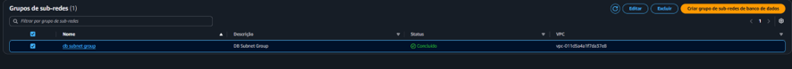
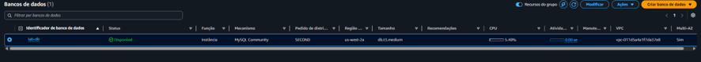
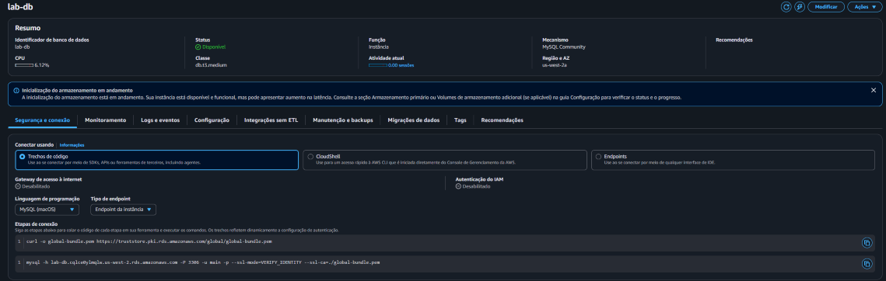
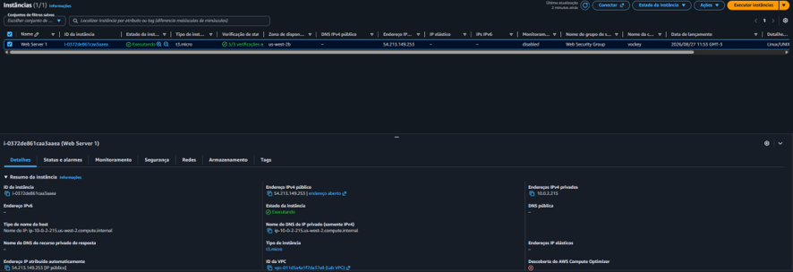
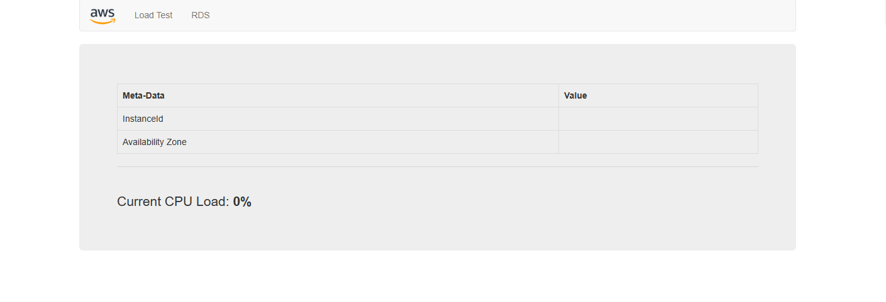
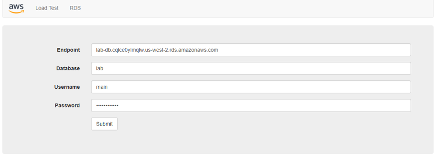
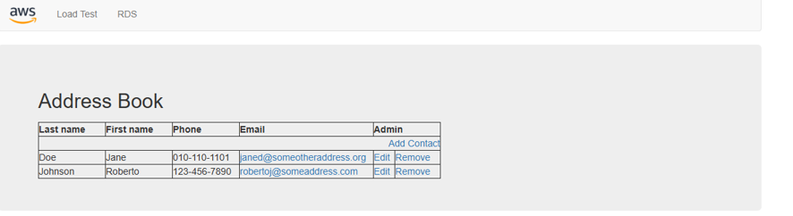

# Laboratório AWS: Criação e Integração de Servidor de Banco de Dados Multi-AZ com Aplicação Web

Este repositório documenta a implementação de uma arquitetura resiliente na **AWS**, abrangendo a configuração de isolamento de rede para camada de dados (Security Groups e Subnet Groups), provisionamento de uma instância de banco de dados relacional **Amazon RDS (MySQL)** em implantação **Multi-AZ** e a integração prática com uma aplicação web conectada via Amazon EC2.

---

## 🏗️ Visão Geral da Arquitetura

- **VPC do Laboratório:** Rede virtual isolada (`Lab VPC`).
- **Segurança de Rede:** Grupo de segurança dedicado (`DB Security Group`) liberando a porta MySQL (3306) exclusivamente a partir da camada web (`Web Security Group`).
- **Subnet Group Multi-AZ:** Associação de duas sub-redes privadas em Zonas de Disponibilidade distintas para suporte a alta disponibilidade.
- **Banco de Dados Relacional:** Amazon RDS (MySQL Community, classe `db.t3.medium`, Multi-AZ) com replicação síncrona.
- **Aplicação Web:** Servidor Apache/PHP executando em instância EC2 (`Web Server 1`) consumindo o banco de dados RDS através de seu endpoint.

---

## 🛠️ Passo a Passo de Implementação

### 🔒 Tarefa 1: Criar um grupo de segurança para a instância de banco de dados do RDS
O objetivo desta etapa foi criar um grupo de segurança para isolar o tráfego da camada de dados, permitindo que apenas servidores web autorizados se comuniquem com o banco.

1. No **Console de Gerenciamento da AWS**, acesse o menu **Serviços** e escolha **VPC** (em *Redes e entrega de conteúdo*).
2. No painel de navegação à esquerda, clique em **Grupos de segurança**.
3. Clique em **Criar grupo de segurança** e configure:
   - **Nome do grupo de segurança:** `DB Security Group`
   - **Descrição:** `Permit access from Web Security Group`
   - **VPC:** `Lab VPC (VPC do laboratório)`
4. Na seção **Regras de entrada**, selecione **Adicionar regra**:
   - **Tipo:** `MySQL/Aurora (3306)`
   - **Origem:** Selecione `Web Security Group` (pesquise por `sg`)
5. Role até o final da página e selecione **Criar grupo de segurança**.

> **Evidência da Tarefa 1:**
> 
> ![Regras de Entrada do DB Security Group]
> *Figura 1: DB Security Group configurado com regra de entrada TCP 3306 associada ao Web Security Group.*

---

### 🌐 Tarefa 2: Criar um grupo de sub-redes de banco de dados (DB Subnet Group)
O DB Subnet Group define o conjunto de sub-redes (em pelo menos duas Zonas de Disponibilidade) onde a instância RDS e suas réplicas síncronas podem ser alocadas.

1. No **Console de Gerenciamento da AWS**, selecione **Serviços** > **RDS** (em *Banco de dados*).
2. No painel de navegação esquerdo, clique em **Grupos de sub-redes**.
3. Clique em **Criar grupo de sub-redes de banco de dados** e configure:
   - **Nome:** `DB Subnet Group`
   - **Descrição:** `DB Subnet Group`
   - **ID da VPC:** `Lab VPC (VPC do laboratório)`
4. Na seção **Adicionar sub-redes para Zonas de disponibilidade**:
   - Selecione a **primeira Zona de Disponibilidade** e marque a sub-rede `10.0.1.0/24`.
   - Selecione a **segunda Zona de Disponibilidade** e marque a sub-rede `10.0.3.0/24`.
5. Clique em **Criar**.

> **Evidência da Tarefa 2:**
> 
> ![Grupo de Sub-redes Criado]
> *Figura 2: Grupo de sub-redes de banco de dados criado e concluído na Lab VPC.*

---

### 🗄️ Tarefa 3: Criar uma instância de banco de dados do Amazon RDS (Multi-AZ)
Nesta etapa foi criada a instância de banco de dados relacional com replicação síncrona de espera (*standby*) em outra AZ, garantindo alta disponibilidade e durabilidade.

1. No painel esquerdo do console RDS, selecione **Bancos de dados** e clique em **Criar banco de dados** (*Criação padrão*).
2. **Opções do mecanismo:**
   - **Tipo de mecanismo:** `MySQL`
   - **Versão do mecanismo:** Versão mais recente
3. **Modelos:** `Dev/teste`
4. **Disponibilidade e durabilidade:** `Instância de banco de dados Multi-AZ`
5. **Configurações:**
   - **Identificador de instância:** `lab-db`
   - **Nome do usuário principal:** `main`
   - **Senha principal:** `lab-password`
   - **Confirmar senha:** `lab-password`
6. **Configuração da instância:**
   - **Classe:** Classes com capacidade de intermitência (`db.t3.medium`)
7. **Armazenamento:**
   - **Tipo de armazenamento:** Finalidade geral (SSD)
8. **Conectividade:**
   - **Nuvem privada virtual (VPC):** `Lab VPC`
   - **Grupo de segurança da VPC:** Selecionar existente > Remover `default` > Adicionar `DB Security Group`
9. **Monitoramento e Configuração adicional:**
   - **Monitoramento aprimorado:** Marcar *Habilitar monitoramento avançado*
   - **Nome do banco de dados inicial:** `lab`
   - **Backup:** Desmarcar *Habilitar backups automatizados* (para fins de agilidade no laboratório)
10. Clique em **Criar banco de dados** e aguarde até que o status mude para **Disponível**.
11. Acesse os detalhes da instância `lab-db` e copie o valor do **Endpoint** (ex.: `lab-db.cqlce0ylmqlw.us-west-2.rds.amazonaws.com`).

> **Evidências da Tarefa 3:**
> 
> ![Instância RDS Multi-AZ Criada]
> *Figura 3: Instância lab-db provisionada como Multi-AZ em status Disponível.*
> 
> ![Detalhes e Conectividade do RDS]
> *Figura 4: Endpoint e parâmetros de conectividade do banco de dados lab-db.*

---

### 💻 Tarefa 4: Interagir com o banco de dados através da aplicação web
Com a infraestrutura de dados no ar, configuramos a aplicação web hospedada no EC2 para ler e persistir dados no RDS.

1. Acesse o console do **Amazon EC2** e localize a instância `Web Server 1`.
2. Obtenha o endereço **IPv4 público** da instância (ex.: `54.213.149.253`).
3. Abra uma nova aba no navegador web e acesse o IP público copiado.
4. Na barra de navegação superior da aplicação web, selecione a opção **RDS**.
5. Preencha o formulário de conexão com os parâmetros definidos:
   - **Endpoint:** `<Endpoint_RDS_copiado>`
   - **Database:** `lab`
   - **Username:** `main`
   - **Password:** `lab-password`
6. Clique em **Submit**.
7. Após a inicialização das tabelas pelo script da aplicação, a página do **Address Book** (Catálogo de endereços) será exibida.
8. Teste as operações de CRUD inserindo, editando e removendo contatos (os dados são automaticamente replicados para a segunda Zona de Disponibilidade).

> **Evidências da Tarefa 4:**
> 
> ![Instância EC2 Web Server 1]
> *Figura 5: Instância EC2 Web Server 1 em execução com IP público atribuído.*
> 
> ![Aplicação Web EC2]
> *Figura 6: Painel inicial da aplicação web.*
> 
> ![Configuração de Conexão RDS] 
> *Figura 7: Formulário de conexão da aplicação apontando para o endpoint do RDS lab-db.*
> 
> ![Address Book Conectado]   
> *Figura 8: Aplicação Address Book persistindo e listando dados gravados no Amazon RDS Multi-AZ.*S

---

## 🎯 Conclusão e Resultados

- **Segurança em camadas (Defense in Depth):** O banco de dados foi isolado em sub-redes privadas sem exposição pública direta, aceitando conexões exclusivamente originadas da camada web via Security Group.
- **Alta Disponibilidade:** Com o RDS Multi-AZ, os dados são gravados sincronicamente entre zonas de disponibilidade, aumentando a tolerância a falhas.
- **Integração Ponta a Ponta:** Demonstração prática do ciclo completo de configuração de conectividade entre servidores de aplicação e bancos de dados relacionais gerenciados na nuvem AWS.